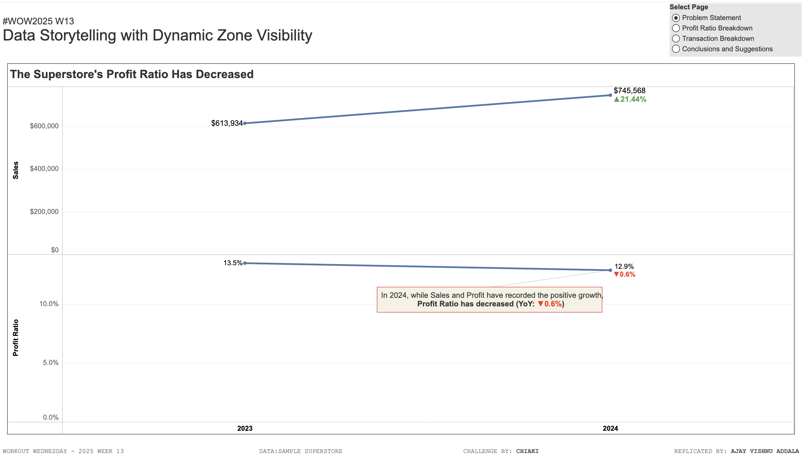

# WOW2025 | Week 13 | Data Storytelling with Dynamic Zone Visibility

## Introduction
Welcome to Week 13 of Workout Wednesday 2025! This challenge is inspired by Chiaki (@ishiaki_tab), a Tableau Visionary since 2024 and the winner of the Viz Games at the Salesforce World Tour Tokyo 2024. 

This week’s challenge focuses on **Dynamic Zone Visibility**, a powerful feature that allows users to dynamically change visualizations and layouts within a single dashboard. This approach enhances data storytelling without relying on Tableau’s Story feature.

## Challenge Requirements
### Dashboard Specifications:
- **Size**: 1400 x 800 px
- **Control Parameter**: Users can switch between different visualizations dynamically.
- **Visuals to include**:
  1. **Sales and Profit Ratio Trends (2023 & 2024)**
     - Annotate the YoY change.
  2. **Comet Chart**
     - Show trends by sub-category for 2023 & 2024 with annotations.
  3. **Sankey Diagram**
     - Categorize order records by:
       - Profit status (negative/positive)
       - Order Year (2023 & 2024)
       - Region
- **Filters**:
  - Sub-Categories: **Tables & Binders**
- **Enhancements**:
  - Use **Viz Extensions** where possible.
  - Match **tooltips and formatting** consistently.

## Tableau Public Link
[View the Dashboard on Tableau Public](https://public.tableau.com/shared/DRCDDNPGF?:display_count=n&:origin=viz_share_link)

## Getting Started
### Steps to Reproduce:
1. **Download the dataset** (if provided by Workout Wednesday).
2. **Load into Tableau** and set up the required data sources.
3. **Create a Parameter** for visualization selection.
4. **Build the three required visualizations**:
   - Line Chart for Sales & Profit Ratio Trends.
   - Comet Chart for Sub-Category Trends.
   - Sankey Diagram for Order Classification.
5. **Apply Dynamic Zone Visibility** to switch between visualizations.
6. **Format the dashboard**, ensuring consistency in tooltips and colors.
7. **Publish to Tableau Public** and share the link.

## Snapshot

## Conclusion
This challenge provides a hands-on opportunity to master **Dynamic Zone Visibility** in Tableau, enabling more interactive and flexible dashboards for storytelling. Try it out and improve your data visualization skills!

---
**Created for Workout Wednesday 2025 | Week 13**
